**Total time spent on project: 28.66h**

_Note: All journal entries from June 24 - 28 were retroactively added from Hack Club's Stardance Platform_

## July 7th: Code and BOM

It was another locked-in day, and once again, I did a lot both big and small things. And yes, I changed the hardware design,
again. Turns out that Tesseract was not at all optimized for cost and pricing, so I had to do some BOM optimization. Originally,
I thought I could get things like threaded inserts and an LED strip from Amazon, but I realized I was overpaying quite a bit
when I found the same things for cheaper on AliExpress. Apart from that small anecdote, today I:

- Wrote a very barebones version of the code for Tesseract that just uses mic and speaker to transcribe audio and get an LLM
  response
- Finished the wiring diagram
- Moved around all the global labels in KiCad so that wires would not go over each other in the physical wiring process,
  and so that assembly would be easier
- Rewired some of the PCB to accomplish the label moving
- Changed some JST connectors to be AM-compatible (some now have a mounting hole present basically)
- Started on the BOM, and realized that this project is very expensive, and did some cost optimization with AliExpress

Now, the BOM, while it is a single bullet point, took a lot longer than expected. This is mainly because I underestimated the
cost of shipping, and using multiple vendors for parts. For example, the rubber feet for Tesseract only cost $4.50 for a large
bag, but shipping from McMaster Carr was around $11 (and there was no other shipping option easily available to find). I'm
planning on uploading the BOM once it's all done (since it's currently on Google Sheets), but I will say right now that it is
getting very close to $180.

I'm so grateful for AliExpress. Hopefully I don't get scammed by some seller on there.

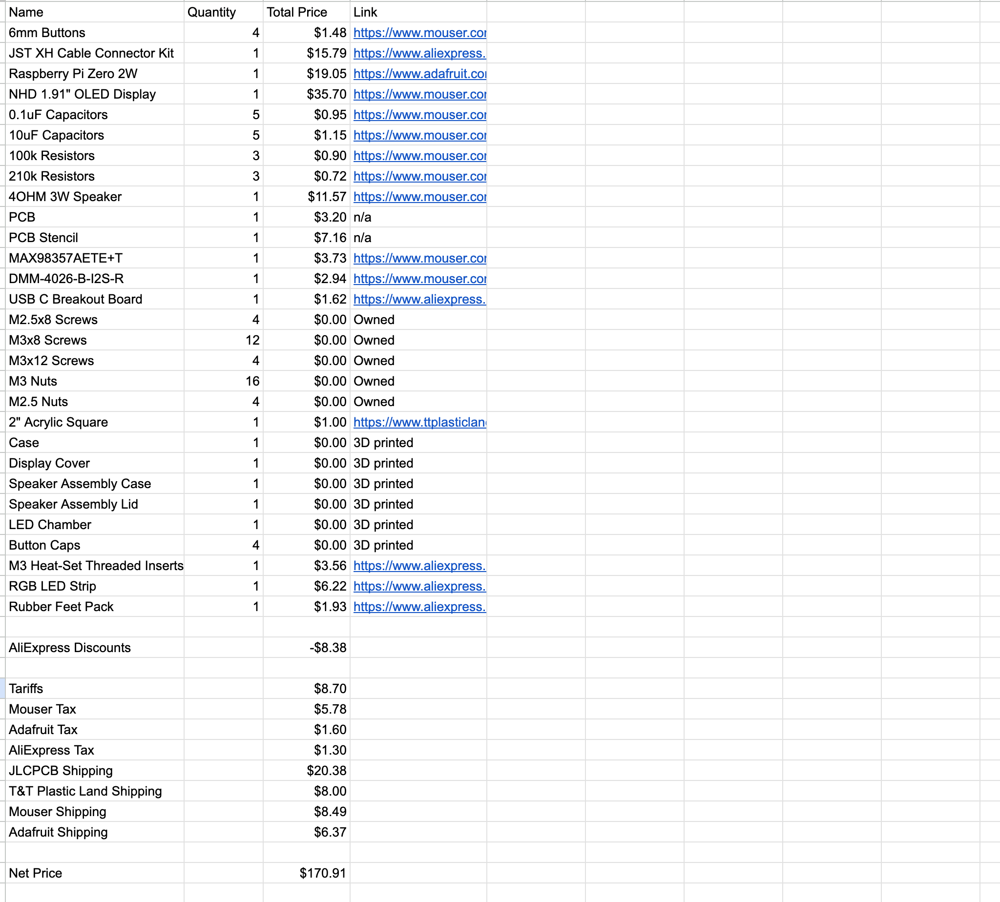

**Total time spent: 4h**

_Side Note: I have no clue now, based off the scouring online that I did, when I will actually finish the physical build of_
_Tesseract. This is because the Raspberry Pi Zero 2W, at the time of writing this, is literally out of stock of every store_
_online (except AliExpress or eBay). Normally, the board costs $15, but on the resell websites, its going for over $80, and_
_I'm not going to pay more than 5x the actual price to get it earlier. For now, I'm just putting it on the BOM for what it_
_would cost if it were in stock at AdaFruit. Hopefully supply chain gets it out soon..._

## July 6th: (Hopefully) All Hardware Design Done

So, I might have lied yesterday when I said that all of the hardware design was done, since I just realized today that the
Raspberry Pi Zero 2W only has one I2S port while creating a wiring diagram for it in Figma, and I have 2 mics and 1 speaker that all
communicate over I2S, and all need to connect to the Pi somehow. What this basically meant was that I ended up spending a bunch
of time on research, which eventually led to me removing the top microphone from the PCB and schematic, and now techincally the
CAD is different as a result. This also meant that I ended up wiring BCLK to SCK, and WS to LRCLK, which left me with two fewer signals
to go the Raspberry Pi as a result. Now, I just have to finish the wiring diagram, write a rough version of the code, and
_fingers crossed_ I should be done with the design phase of this project.

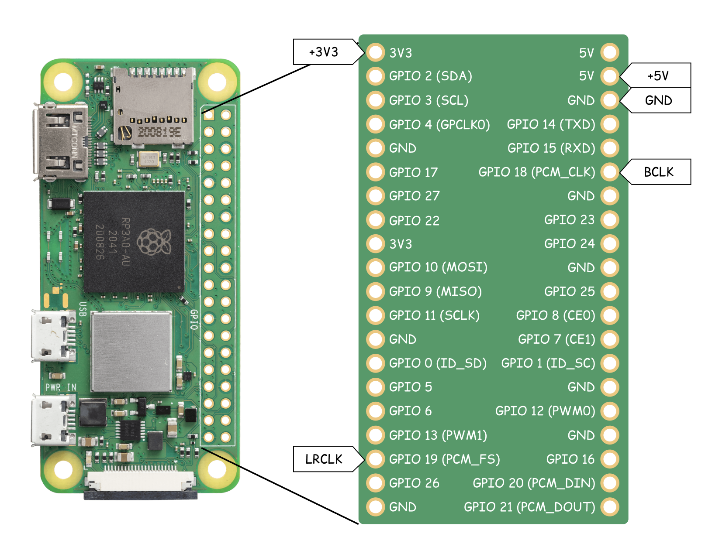

**Total time spent: 1.5h**

## July 5th: All Hardware Design Done

It was very much a tedious process, but I finished both the PCB and the CAD of Tesseract. In order to get to that though, a lot
of work had to be done, and going over all of them individually would probably lead to me writing an essay for this journal
entry. At a high level though, today I:

- Built a chamber for WS2812b LED strip to mount onto
- Added in a translucent acrylic diffuser (and mounting for it) in the LED slot on the top
- Moved the LED mounting holes on the PCB to the correct spot
- Added standoffs for the display cover so the PCB mounts vertically off of it
- Added a small cutout for USB C connector pins (so the board can be flush on the bottom)
- Added small cutouts for the USB C connector screws at the bottom so that they would be flush and not protrude out
- Found microphone IC STEP file and added that to the PCB
- Made 4 button caps that go on top of the 6mm tactile switches on PCB
- Made a sample image (for decal on screen) of the time and date that I will _hopefully_ be able to code fairly easily
- Rendered the whole project using Autodesk Fusion

The buttons in particular were _very_ painstakingly tedious to get aligned properly, as I had to see that they were misaligned in
the CAD, "fix it" in the PCB, and then bring it back into the CAD only to realize that my "fix" (of moving them up or down) didn't work,
and I would have to move the buttons again in the PCB, bring the entire PCB back into OnShape, redo some assembly mating, and so on.
I thought it would be faster, but it took me 4 attempts to get the button placement just right for the CAD. After the button placement
was resolved, and everything was somehow done, I spent over an hour fiddling around with materials, lighting, and apperances in Autodesk
Fusion until I got the brightness and light diffusion working to my liking. Eventually though, I chose three of the best renders, and
I put them in the assets folder of this project for you to see. Right now at least though (for better or worse), you can't see the side
grill design on Tesseract, so I might change that later, or might not. We'll see how I like it over time, and whether I'm going to redo
all the renders.

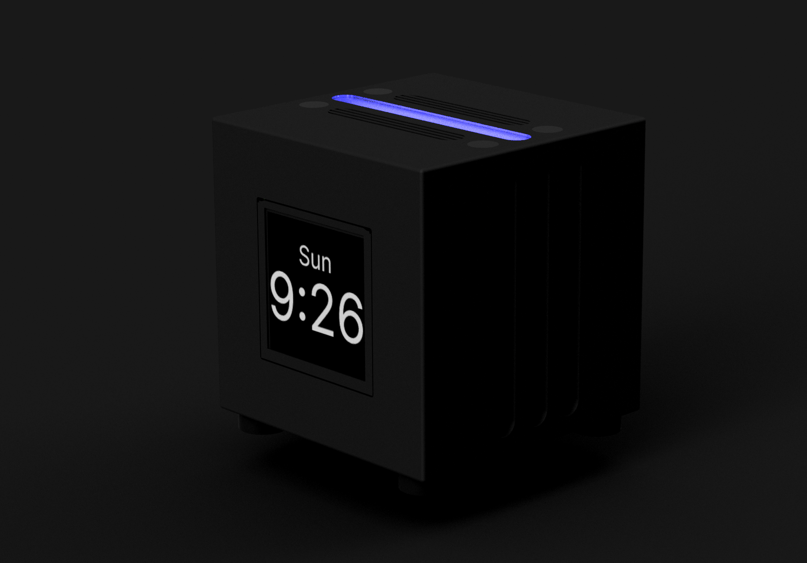

**Total time spent: 4.75h**

## July 3rd: PCB Routing

I finished up adding labels to all the pins on the front of the PCB with silkscreen text. After that was done though, I got to
routing the board. What I realized though midway through routing was that I actually forgot to include a 3V3 line from the
Raspberry Pi Zero 2W on the PCB, so I added that to the schematic JST connector that has all the power connections to the RPI.
Once that was fixed and routing was done, I went back and forth with Design Rules Checker, only to find that the circle pad for
the microphones (which should be connected to GND) was sort of broken. Instead of the whole ring being GND in KiCad, only a small
square on the edge is considered as the "pin". I ignored this though and still routed a trace to the entire ring, which promptly
gave me a lot of errors from DRC. It should be fine, so I tried to exclude as many of the circle-pad related errors, but there's
still 3 that persist despite my best whack-a-mole efforts. I could try and fix it, but at this point it's faster to just ignore the
"errors" in DRC.

Apart from the microphone pad issues, the PCB is basically done at this point. All that is left is adding slots for the LED chamber
that I plan to mount on top of the PCB. I currently have a hole on the left of the PCB so that the JST connector from the LED can
be connected on the backside of the board, and I also have two M3 screw holes so that the chamber itself can be mounted to the PCB.
All that's to say, I just need to finalize the screw holes and wire hole for the LED chamber, and the PCB will be officially complete.

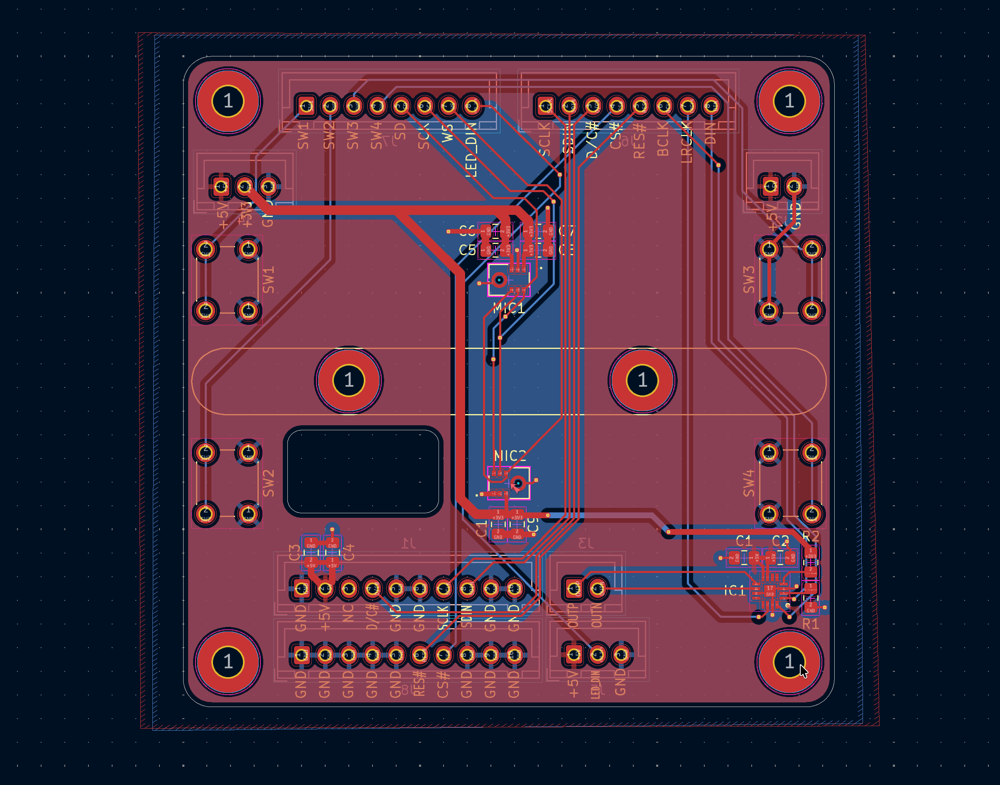

**Total time spent: 2h**

## June 30th: PCB Placement

I managed to finalize the layout of the PCB today, and the schematic as well. This took longer than I expected, as I had to
constantly go back and forth tweaking both the cutouts of the top of Tesseract in CAD, and tweaking the size of the top strips
in order for everything to fit on the PCB. My original design had the buttons too close to the edge of the cube case, which
essentially required me to have the buttons less than 0.3 mm away from the edge of the PCB. I also changed the middle strip cutout
to fit in a 2" x 2" acrylic square, which I found a sample online for $1. It took a few tries, but eventually I just succumbed to
making the PCB take up as much of the available space on the top (which is why it now looks like a square). I collected dimensions
from CAD to move the microphones and buttons exactly where they need to be in KiCad. Finally, I wanted to add silkscreen text so I
know which wire goes to which wire during assembly, so I started on that before eventually calling it a day. Once the silkscreen pin labels are done though, it's off to routing!

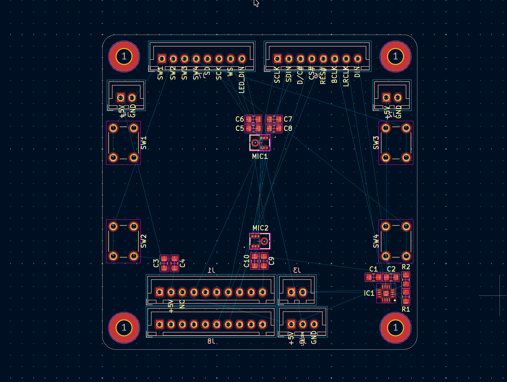

**Total time spent: 3h**

## June 29th: Redesign, redesign

I worked into the wee hours of midnight this morning and yesterday afternoon to fix a bunch of small things and add a few small
things to the project. There's a lot of changes (since it was around 5h worth of work), so here's a quick list of everything that
changed from the last devlog:

- Changed speaker grills to be alternating so that they would allow for more airflow
- Added in SparkFun USB C Horizontal Connector breakout board, and a slot and screws for it in the case
- Designed a speaker enclosure from scratch so that the speaker can sound better and be sealed
- Redesigned the top cutout design to accomodate for a larger light strip, larger buttons, and mic grills
- Made the side grills not penetrate the enclosure, so you can't see inside and the design is more consistent overall
- Fixed everything else to still fit in the enclosure (ie getting larger screws, moving around mounting points, making cutout slots)

Out of all of the above bullet points, the speaker enclosure in particular took quite a bit of time, as I tried to make it as big
as practically possible without it stealing space for other components. The top cutout design also took a little bit of trial and
error, as I experimented with different strip lengths, spacings, and button sizes. I also couldn't find a CAD model for the longest
time for the SparkFun USB C breakout board, so I had to open and fix the Eagle files with a correct USB C footprint and export it
to get a STEP file for the assembly. Took way longer than I expected (and probably than it should have), since I really, _really_
wanted to get the placement of the actual USB C receptacle right to make a precise cutout in the enclosure case.

It's slowly starting to get finished!

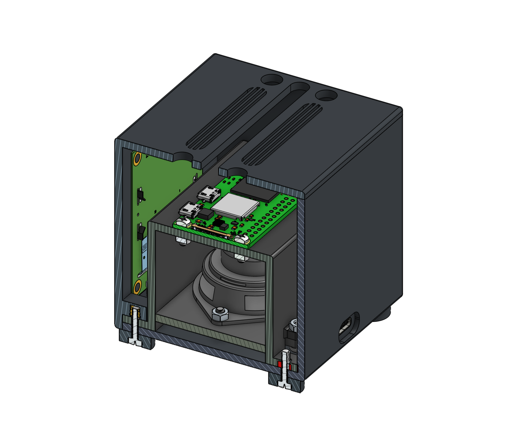

**Total time spent: 5h**

## June 27th: Designing the PCB

After a (very tragic) discovery that basically nobody online sells 2x9 or 2x10 JST connectors, I updated my schematic to use 2 1x10
or 1x9 JST XH connectors for the connections to the OLED display and RPI Zero 2W. I found footprints for all my symbols, finished
the schematic, and started the PCB layout process. Turns out that JST sockets are pretty big (relatively speaking). I did some layout
work, and now I have a rough sense of where everything will go (see pic below), but I still need to finalize all the positions in CAD
so everything is precise and lines up. Although I wanted to keep the PCB as small as I could, something tells me that I might have
to make it bigger to allow for more room and spacing for components.

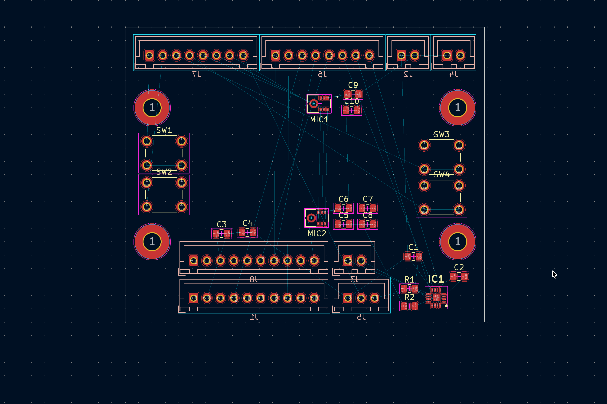

**Total time spent: 1.73h**

## June 26th: Schematic Time

Decided to take a break from the CAD to focus on designing a PCB that will serve as a middle man between the Pi and the other
electronics. I finished most of the schematic (still need to add LEDs), and had to do a fair share of datasheet reading in order to
figure out what to wire to what. Right now the schematic has a speaker IC, two microphones, a display connector, a giant connector to
the Raspberry Pi (which I plan to separate at the endpoint into individual wires), 4 push buttons, and lots of decoupling capacitors.
I haven’t decided fully on footprints for some symbols (like the connectors), but I’m leaning right now towards JST connectors so
that the inside of the cube is not a messy wire spaghetti. _ Fingers crossed _ this schematic doesn’t lead to me making a broken PCB.

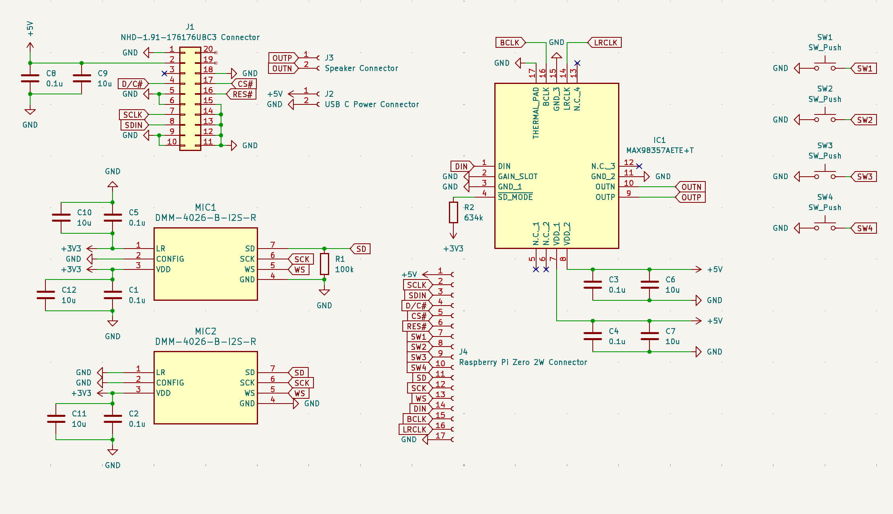

**Total time spent: 1.68h**

## June 25th: Cutouts

Moved the Raspberry Pi Zero 2W from being mounted on the ceiling to being mounted with standoffs above the speaker. In the process,
I also modified the speaker mount that I made last time to use threaded inserts so the case could be 3D printed easier. After this,
I wanted the cube to look better, so I added some cutouts on the sides for LEDs, buttons, and for the microphone. Finally, I ended
this session by rounding all the corners ever so slightly with a 1mm fillet, so it won’t be as sharp to touch.

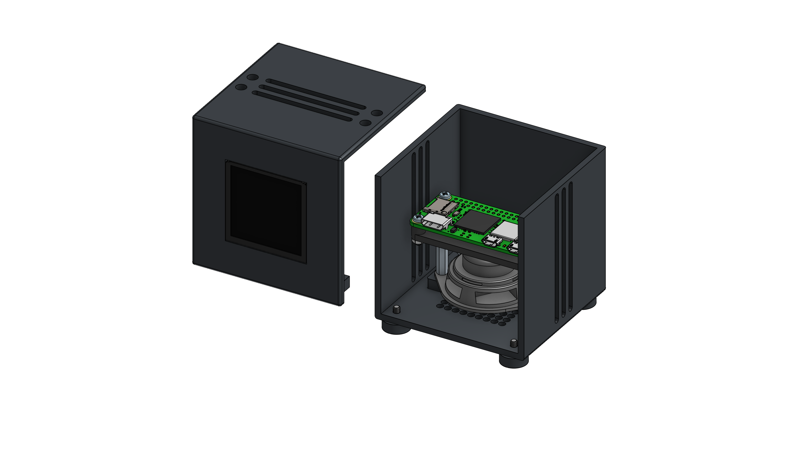

**Total time spent: 1.67h**

## June 24th: Adding the Speaker

I realized that I needed space to have rubber feet (so that the downward firing speaker’s audio isn’t muffled), so I had to redesign
the speaker grill to be smaller. I added in some rubber feet once that was done and there was room. In the process, I also decided
to use the rubber feet’s screws as a way to screw the display cover and the rest of the enclosure. Finally, I went on Mouser and
found a pretty good fitting speaker for the case, and I mounted it inside the cube with some M3 screws and nuts.

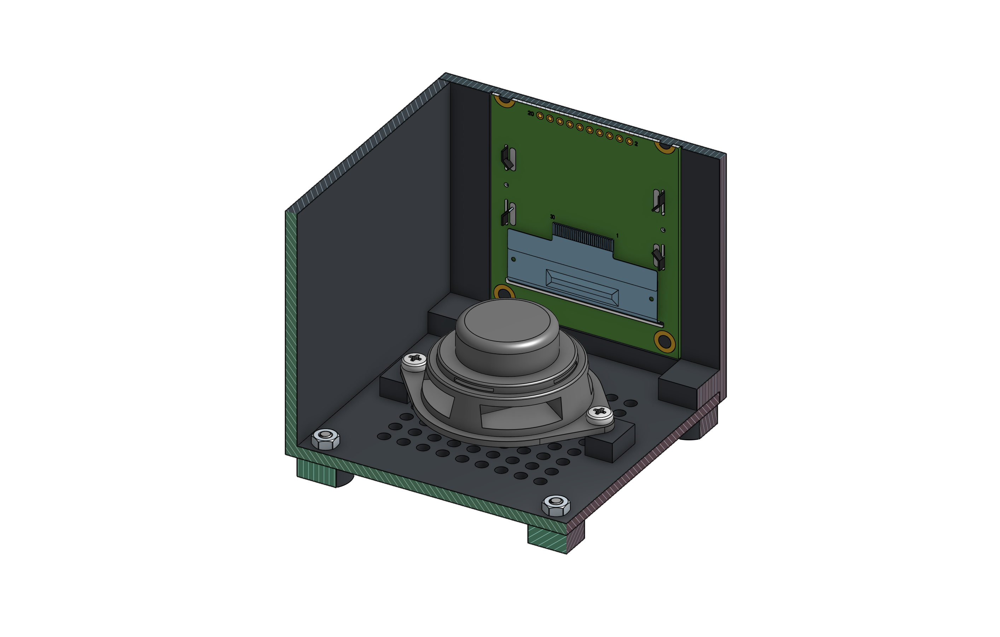

**Total time spent: 1.83h**

## June 17th: Start!

I decided to try and build my own smart speaker for my room, since I was curious about creating a more agentic
AI smart assistant than what I have write now with an Echo Dot. I mostly worked on CAD today (techincally yesterday but
I decided to put my designing into a journal as well as lapsing it). A really important feature of the design that I want
is for my smart assistant to be a cube, and for it to be like an alarm clock with a display on the front. Hence the name,
_Tesseract_ (a cube that has time).

In the CAD specifically, I made some speaker grill holes on a plate in the bottom for the downward firing speaker. I decided
to use a Raspberry Pi Zero 2W for now to serve as a lightweight computer to record audio and send it to cloud APIs. In addition,
I also settled on using a 1.91" OLED display for the actual alarm clock face. I wanted square OLED specifically here so that I
would avoid having a not true black of an LCD blaring in my face at night, and also have the tesseract-y vibe of two squares
nested inside each other. Currently I have a display cover in the CAD that has a slot for the display, and I plan on using
threaded inserts to mount the RPI Zero 2W to the case.

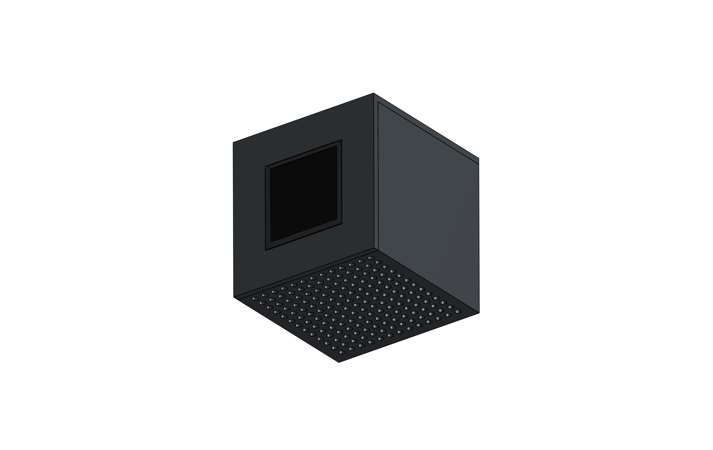

**Total time spent: 1.5h**
