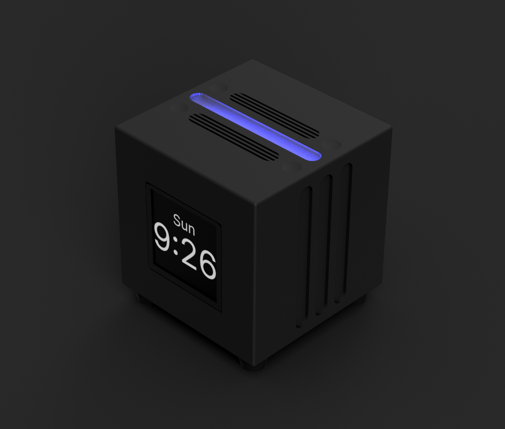
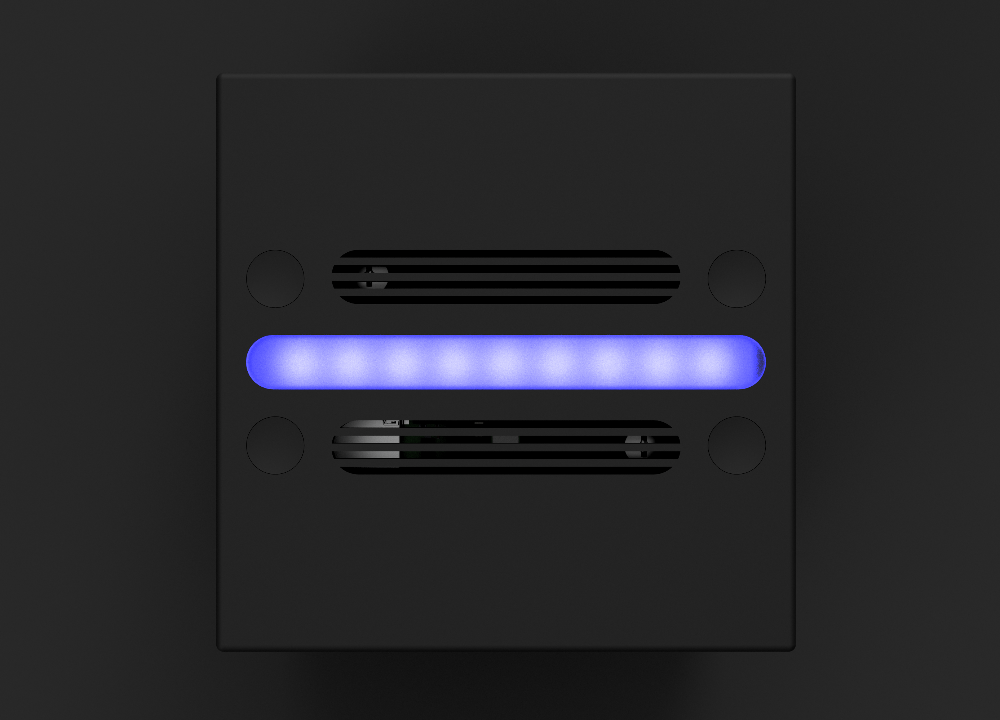
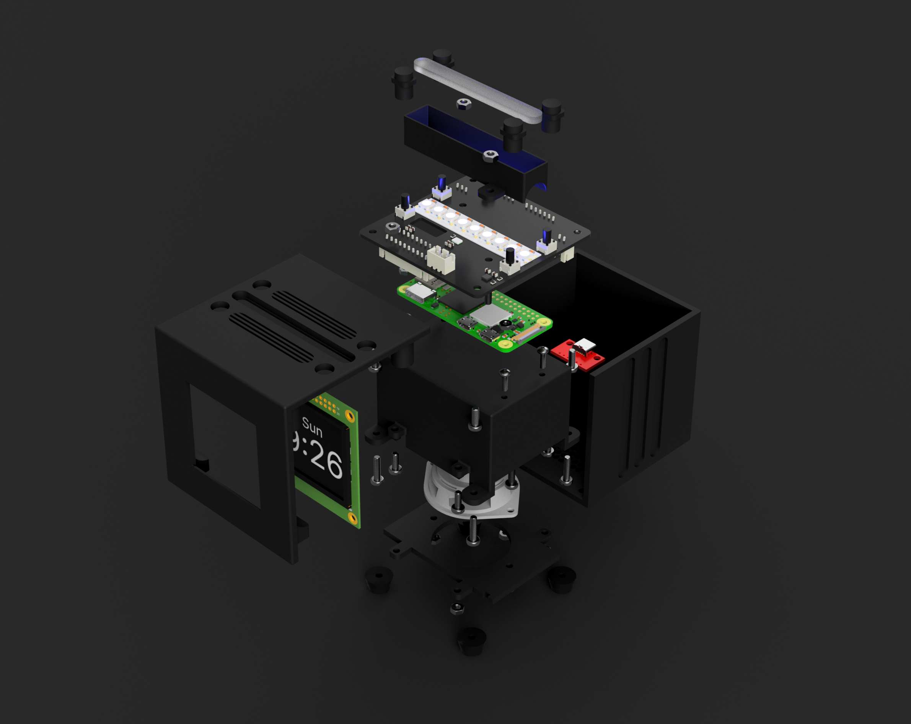
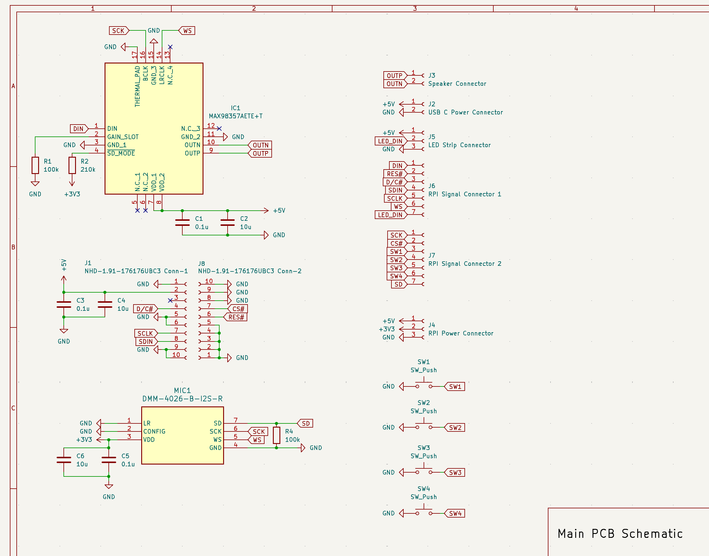
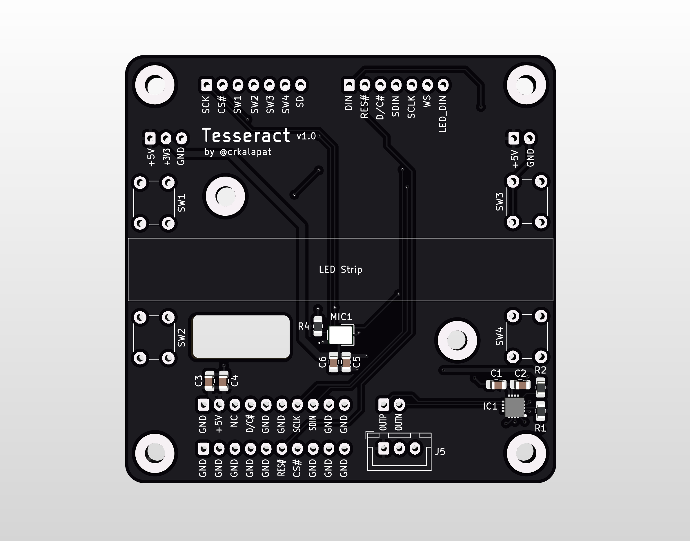
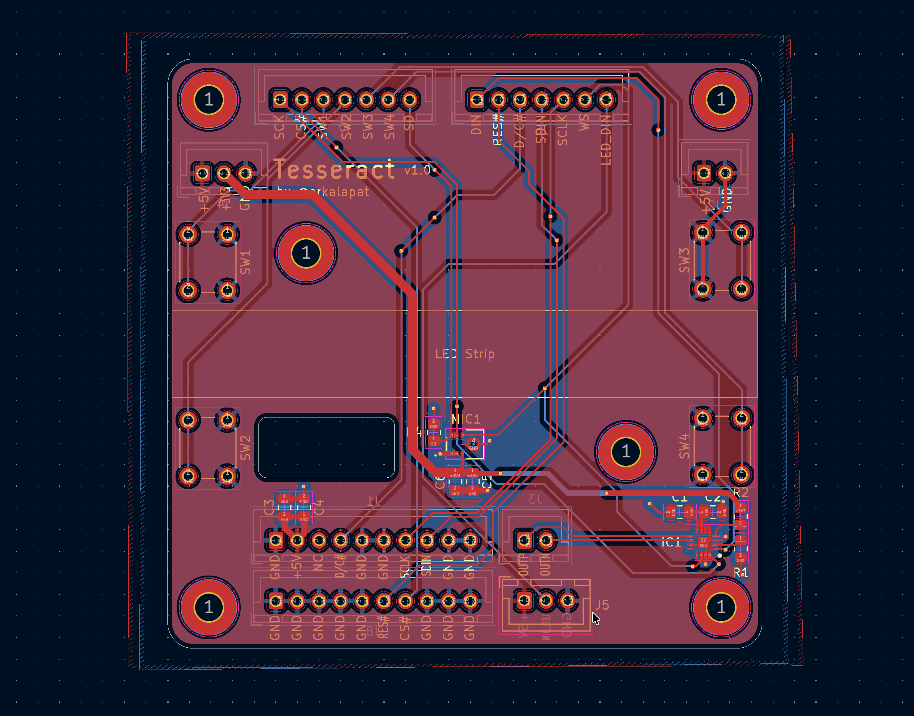
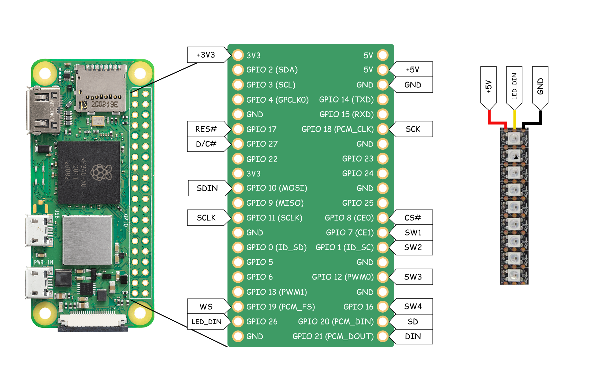

  

# Tesseract

_An open-source smart speaker_

Tesseract is a smart speaker that lets you communicate with your favorite AI, without having to pick
up your phone or get on your computer. It's powered primarily by a Raspberry Pi Zero 2W, which connects
to a custom PCB that links the Pi up to a microphone, speaker, display, buttons, and an LED strip. All
you need to do to provide is an OpenRouter API key to access their wide selection of both large language
models and voice models.

In addition to its AI capabilities, Tesseract also doubles as an alarm clock with its display. I specifically
chose an OLED display for Tesseract for this reason, so that at night there would not be a backlight that can be
potentially distracting. The alarm clock idea though served as inspiration for the project name, _Tesseract_,
since the project is a cube that also has time inside it (like a 4D cube).

## Features

- Crisp 1.91" Square OLED Display
- Colorful RGB WS2812b LED Strip
- Compact 4 Ohm Speaker
- 4 Programmable Buttons
- Built-in Microphone
- 2.4Ghz WiFi Connectivity
- Powered via USB-C

## Schematic

## PCB

 

## Wiring Diagram

## CAD

You can find the STEP file for the assembled version of Tesseract in the `cad/` directory along with printable
STL files. If you prefer, you can also [view the project in OnShape.](https://cad.onshape.com/documents/c663113203f550a8dc1a02a8/w/2121a6af79302a6b1759fafd/e/e3a5e453c89e8346d1915b92)
Or alternatively, you can find renders of the CAD in the `assets/` subdirectory.

## BOM

_More detailed BOM with links can be found under BOM.csv in main directory_

| Name                               | Quantity | Total Price |
| ---------------------------------- | -------: | ----------: |
| 6mm Buttons                        |        4 |       $1.48 |
| JST XH Cable Connector Kit         |        1 |      $15.79 |
| Raspberry Pi Zero 2W               |        1 |      $19.05 |
| NHD 1.91" OLED Display             |        1 |      $35.70 |
| 0.1uF Capacitors                   |        5 |       $0.95 |
| 10uF Capacitors                    |        5 |       $1.15 |
| 100k Resistors                     |        3 |       $0.90 |
| 210k Resistors                     |        3 |       $0.72 |
| 4Ohm 3W Speaker                    |        1 |      $11.57 |
| PCB                                |        1 |       $3.20 |
| PCB Stencil                        |        1 |       $7.16 |
| MAX98357AETE+T                     |        1 |       $3.73 |
| DMM-4026-B-I2S-R                   |        1 |       $2.94 |
| USB-C Breakout Board               |        1 |       $1.62 |
| (Owned) M2.5×8 Screws              |        4 |       $0.00 |
| (Owned) M3×8 Screws                |       12 |       $0.00 |
| (Owned) M3×12 Screws               |        4 |       $0.00 |
| (Owned) M3 Nuts                    |       16 |       $0.00 |
| (Owned) M2.5 Nuts                  |        4 |       $0.00 |
| 2" Plastic 2477 Square             |        1 |       $1.00 |
| (3D Printed) Case                  |        1 |       $0.00 |
| (3D Printed) Display Cover         |        1 |       $0.00 |
| (3D Printed) Speaker Assembly Case |        1 |       $0.00 |
| (3D Printed) Speaker Assembly Lid  |        1 |       $0.00 |
| (3D Printed) LED Chamber           |        1 |       $0.00 |
| (3D Printed) Button Caps           |        4 |       $0.00 |
| M3 Heat-Set Threaded Inserts       |        1 |       $3.56 |
| RGB LED Strip                      |        1 |       $6.22 |
| Rubber Feet Pack                   |        1 |       $1.93 |
| AliExpress Discounts               |          |      -$8.38 |

### Other Expenses

| Item                      |        Cost |
| ------------------------- | ----------: |
| Tariffs                   |       $8.79 |
| Mouser Tax                |       $5.78 |
| Adafruit Tax              |       $1.60 |
| AliExpress Tax            |       $1.30 |
| JLCPCB Shipping           |      $23.58 |
| T&T Plastic Land Shipping |       $8.00 |
| Mouser Shipping           |       $8.49 |
| Adafruit Shipping         |       $6.37 |
| **Total**                 | **$174.20** |
