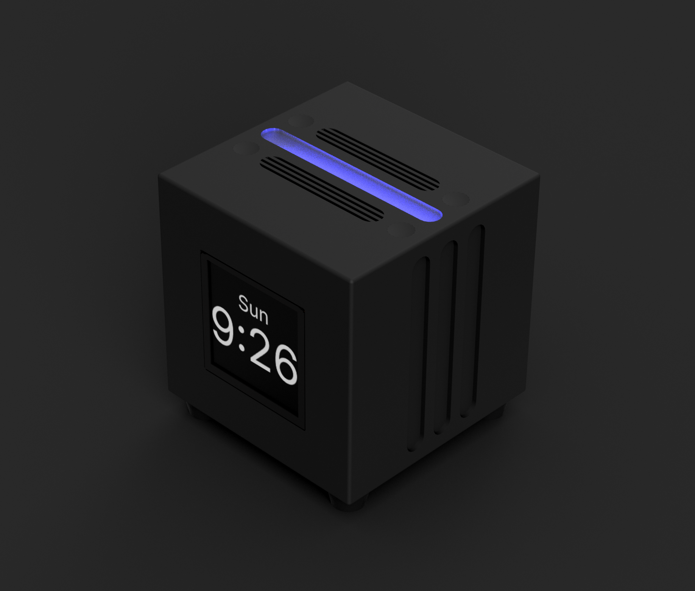
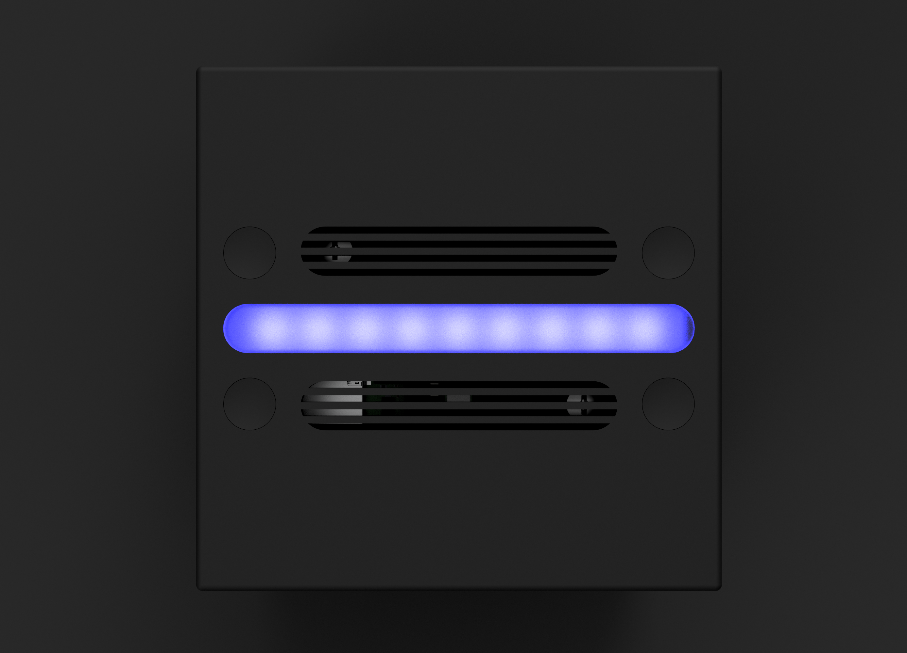
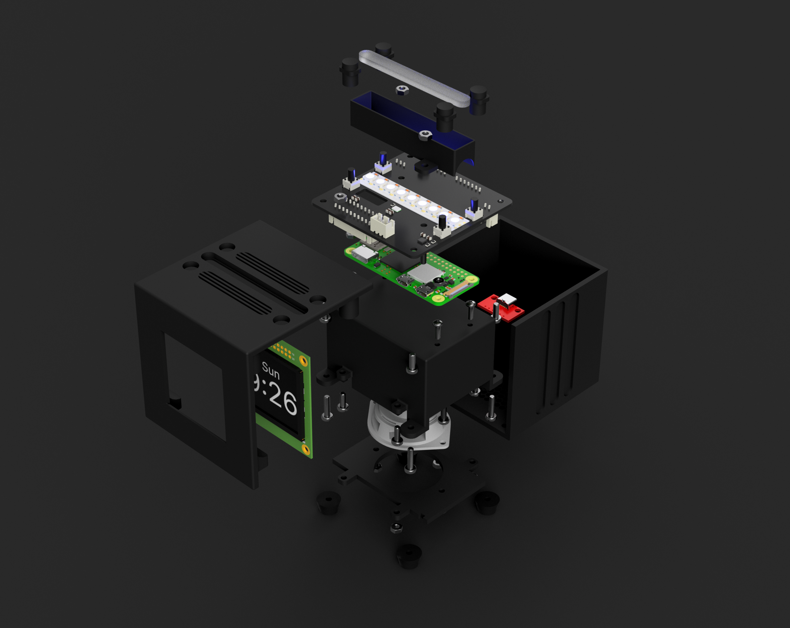
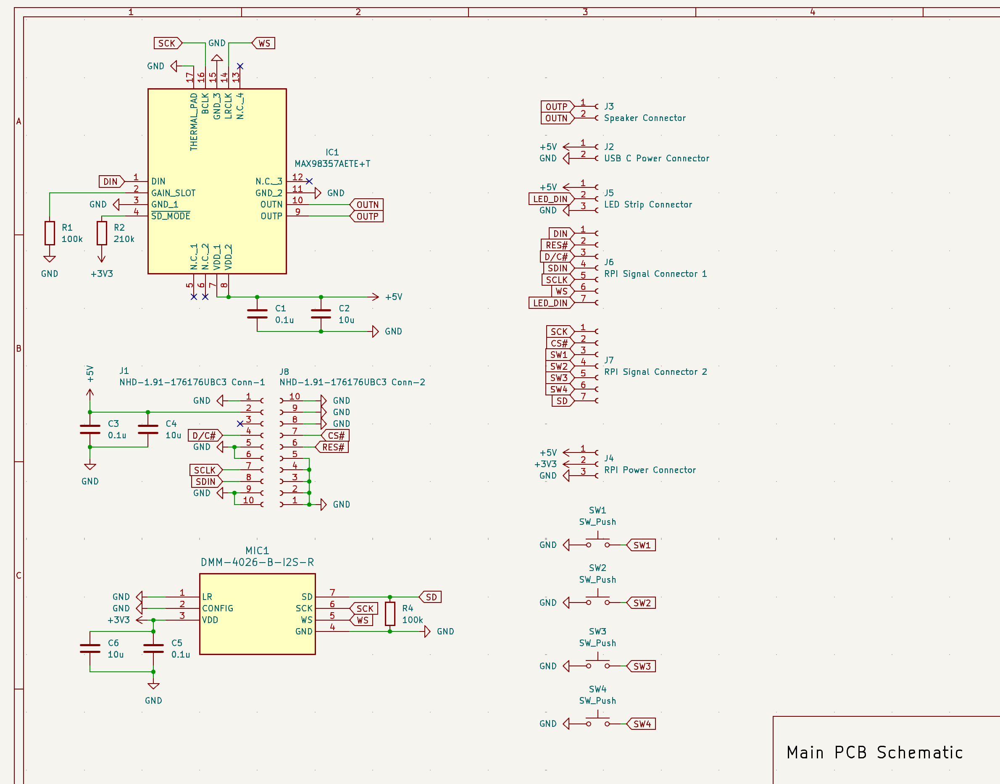
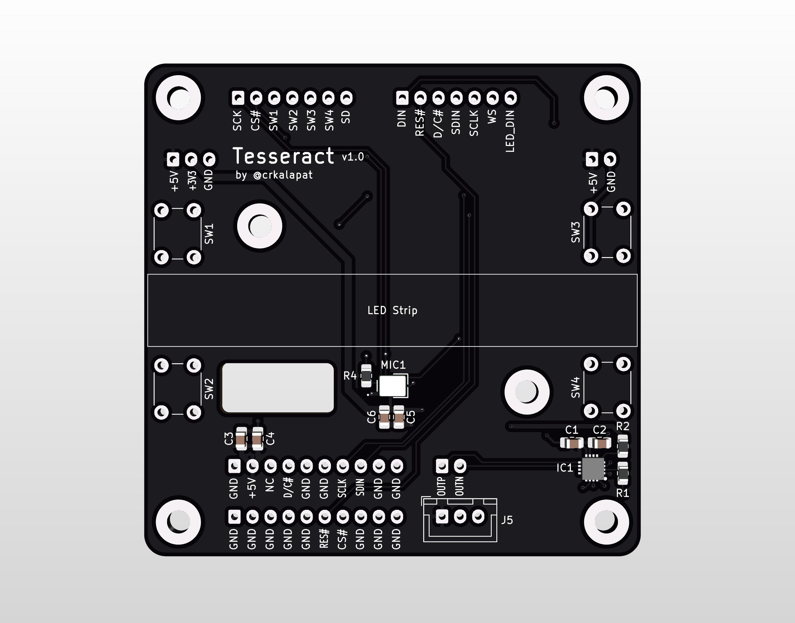
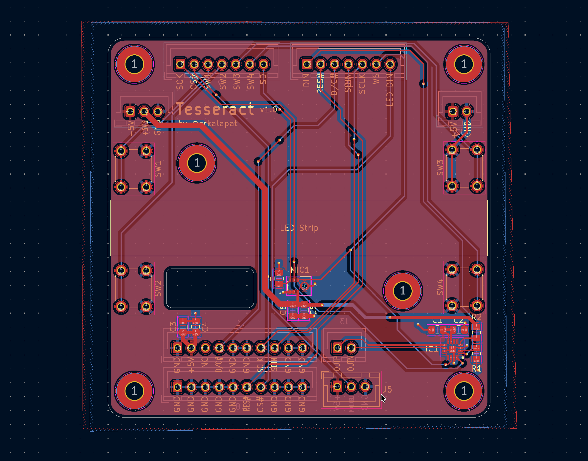
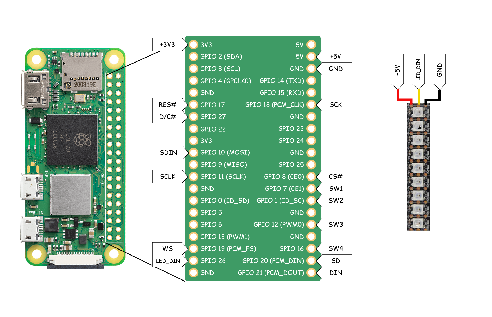

  

# Tesseract

_An open-source smart speaker that works with any AI you want_

Tesseract is a smart speaker that lets you talk to your favorite AI without picking up your phone or getting on your computer. You pick the model (Claude, GPT, open source models, or whatever else you like), and you can switch any time a better one comes out. I'm also planning smart home integration, so you'll be able to control your devices from Tesseract itself or from the Claude or ChatGPT app.

I started this project because assistants like Alexa are way behind frontier models, and with how often the frontier labs leapfrog each other, being stuck with one assistant doesn't make much sense anymore.

## Status

- [x] Enclosure CAD and PCB design
- [x] v1 boards fabricated
- [ ] Assembly
- [ ] Firmware
- [ ] Smart home integration (planned)

## Hardware

Tesseract runs on a Raspberry Pi Zero 2W connected to a custom PCB that links it to a microphone, speaker, display, buttons, and an LED strip. All you need to provide is an OpenRouter API key, which gives you access to a wide range of language and voice models.

It also works as an alarm clock. I went with an OLED display so there's no backlight lighting up the room at night. The alarm clock is also where the name came from, since it's a cube with time inside it, kind of like a 4D cube.

## Features

- Crisp 1.91" Square OLED Display
- Colorful RGB WS2812b LED Strip
- Compact 4 Ohm Speaker
- 4 Programmable Buttons
- Built-in Microphone
- 2.4Ghz WiFi Connectivity
- Powered via USB-C

## Schematic

## PCB

 

## Wiring Diagram

## CAD

You can find the STEP file for the assembled version of Tesseract in the `cad/` directory along with printable
STL files. If you prefer, you can also [view the project in OnShape.](https://cad.onshape.com/documents/c663113203f550a8dc1a02a8/w/2121a6af79302a6b1759fafd/e/e3a5e453c89e8346d1915b92)
Or alternatively, you can find renders of the CAD in the `assets/` subdirectory.

## BOM

_More detailed BOM with links can be found under BOM.csv in main directory_

| Name                               | Quantity | Total Price |
| ---------------------------------- | -------: | ----------: |
| 6mm Buttons                        |        4 |       $1.48 |
| JST XH Cable Connector Kit         |        1 |      $15.79 |
| Raspberry Pi Zero 2W               |        1 |      $19.05 |
| NHD 1.91" OLED Display             |        1 |      $35.70 |
| 0.1uF Capacitors                   |        5 |       $0.95 |
| 10uF Capacitors                    |        5 |       $1.15 |
| 100k Resistors                     |        3 |       $0.90 |
| 210k Resistors                     |        3 |       $0.72 |
| 4Ohm 3W Speaker                    |        1 |      $11.57 |
| PCB                                |        1 |       $3.20 |
| PCB Stencil                        |        1 |       $7.16 |
| MAX98357AETE+T Speaker IC          |        1 |       $3.73 |
| DMM-4026-B-I2S-R Microphone        |        1 |       $2.94 |
| USB-C Breakout Board               |        1 |       $1.62 |
| (Owned) M2.5×8 Screws              |        4 |       $0.00 |
| (Owned) M3×8 Screws                |       12 |       $0.00 |
| (Owned) M3×12 Screws               |        4 |       $0.00 |
| (Owned) M3 Nuts                    |       16 |       $0.00 |
| (Owned) M2.5 Nuts                  |        4 |       $0.00 |
| 2" Plastic 2477 Square             |        1 |       $1.00 |
| (3D Printed) Case                  |        1 |       $0.00 |
| (3D Printed) Display Cover         |        1 |       $0.00 |
| (3D Printed) Speaker Assembly Case |        1 |       $0.00 |
| (3D Printed) Speaker Assembly Lid  |        1 |       $0.00 |
| (3D Printed) LED Chamber           |        1 |       $0.00 |
| (3D Printed) Button Caps           |        4 |       $0.00 |
| M3 Heat-Set Threaded Insert Bag    |        1 |       $3.56 |
| WS2812b LED Strip                  |        1 |       $6.22 |
| Rubber Feet Pack                   |        1 |       $1.93 |
| AliExpress Discounts               |          |      -$8.38 |

### Other Expenses

| Item                      |        Cost |
| ------------------------- | ----------: |
| Tariffs                   |       $8.79 |
| Mouser Tax                |       $5.78 |
| Adafruit Tax              |       $1.60 |
| AliExpress Tax            |       $1.30 |
| JLCPCB Shipping           |      $23.58 |
| T&T Plastic Land Shipping |       $8.00 |
| Mouser Shipping           |       $8.49 |
| Adafruit Shipping         |       $6.37 |
| **Total**                 | **$174.20** |
